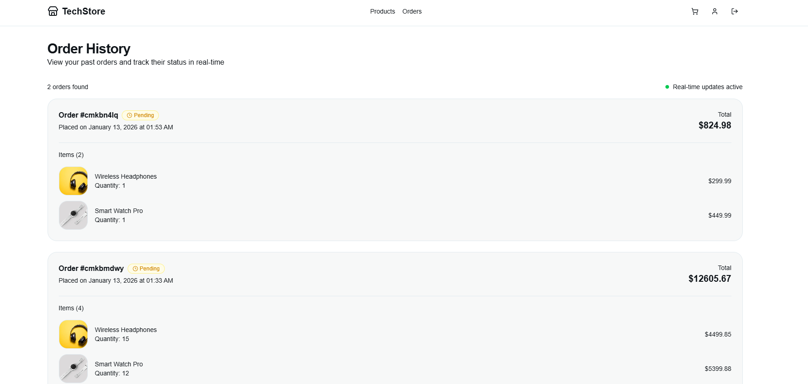
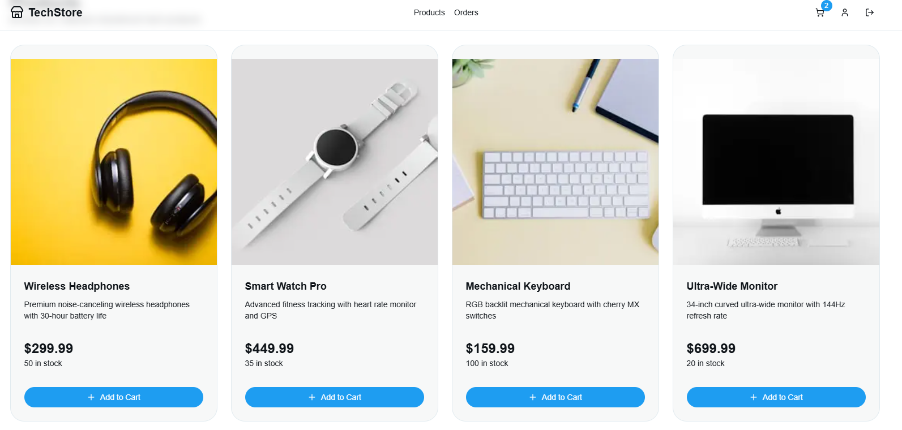
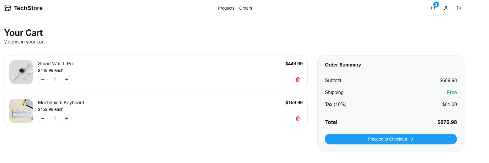

# Real-Time E-Commerce Dashboard

A modern, production-ready e-commerce platform built with Next.js 16, featuring real-time order tracking powered by Apache Kafka and WebSockets. This application demonstrates event-driven architecture for scalable, real-time data synchronization.

## 🏗️ Architecture Overview

This application implements a sophisticated event-driven architecture that separates concerns and enables real-time user experiences at scale.

### Why Kafka?

**Apache Kafka** serves as the backbone of our event streaming platform:

- **Decoupling**: Kafka acts as a message broker between the Next.js application and the WebSocket server, allowing them to operate independently. The web application can produce order events without knowing about connected clients.

- **Scalability**: Kafka can handle millions of events per second, making it perfect for high-traffic e-commerce scenarios. As your business grows, Kafka scales horizontally across multiple brokers.

- **Reliability**: Events are persisted to disk and replicated across brokers, ensuring no order data is lost even if services crash. The `fromBeginning: true` configuration allows consumers to replay all historical events.

- **Event Sourcing**: All order state changes are captured as immutable events in the `order-events` topic, creating an audit trail and enabling features like order history replay, analytics, and debugging.

- **Microservices Ready**: Kafka enables a transition to microservices architecture. Multiple consumers can subscribe to the same topic - you could add inventory management, notification services, or analytics pipelines without modifying existing code.

### Why Next.js 16?

**Next.js 16** provides cutting-edge features for modern web development:

- **Server Components**: Pages like `/dashboard` and `/orders` use React Server Components to fetch data directly on the server, reducing client-side JavaScript and improving performance.

- **Server Actions**: The checkout flow uses server actions (`checkout` in `action.ts`) for secure, type-safe mutations without building API routes. Form submissions are handled seamlessly with progressive enhancement.

- **Advanced Caching**: Next.js 16's `"use cache"` directive optimizes product listings, while the `connection()` API ensures dynamic order data stays fresh.

- **App Router**: File-based routing with layouts enables nested UI patterns, route groups (like `(protected-route)` and `(auth)`), and better code organization.

- **Built-in Optimizations**: Automatic code splitting, image optimization with the `<Image>` component, and font optimization deliver faster page loads.

- **TypeScript-First**: Full TypeScript support with Prisma-generated types ensures type safety across the entire stack.

### Why WebSockets?

**WebSockets** enable bidirectional, real-time communication:

- **Instant Updates**: When an order is created, all connected clients receive updates immediately without polling. Users see order status changes in real-time.

- **Efficient**: Unlike HTTP polling (requesting updates every few seconds), WebSockets maintain a persistent connection, reducing server load and network overhead by ~99%.

- **Low Latency**: Sub-second latency for order notifications compared to 5-30 second delays with traditional polling approaches.

- **Better UX**: The connection indicator (green/red dot) shows users when real-time updates are active, building trust and reducing confusion.

- **Event-Driven**: Socket.IO's event-based API (`socket.on('order-event')`) makes it simple to broadcast different event types to different user segments.

## 🔄 How It Works

### Complete Data Flow

```
┌─────────────────────────────────────────────────────────────────┐
│                     1. User Places Order                        │
│  User fills checkout form → Server Action validates data        │
└────────────────────┬────────────────────────────────────────────┘
                     │
                     ▼
┌─────────────────────────────────────────────────────────────────┐
│              2. Order Saved to Database                         │
│  Prisma creates Order + OrderItems in SQLite database           │
└────────────────────┬────────────────────────────────────────────┘
                     │
                     ▼
┌─────────────────────────────────────────────────────────────────┐
│           3. Event Published to Kafka                           │
│  produceOrder() sends {orderId, userId, status} to topic        │
│  Topic: "order-events" | Broker: localhost:9092                 │
└────────────────────┬────────────────────────────────────────────┘
                     │
                     ▼
┌─────────────────────────────────────────────────────────────────┐
│          4. Kafka Consumer Receives Event                       │
│  consumer-hub.js polls Kafka, deserializes message              │
│  Consumer Group: "dashboard-group"                              │
└────────────────────┬────────────────────────────────────────────┘
                     │
                     ▼
┌─────────────────────────────────────────────────────────────────┐
│         5. WebSocket Broadcasts to Clients                      │
│  Socket.IO emits "order-event" to all connected browsers        │
│  Port: 4000 | Transport: WebSocket + Polling fallback           │
└────────────────────┬────────────────────────────────────────────┘
                     │
                     ▼
┌─────────────────────────────────────────────────────────────────┐
│       6. Client Receives Real-Time Update                       │
│  useOrderEvents hook filters by userId, triggers toast          │
│  Page reloads to show new order in history                      │
└─────────────────────────────────────────────────────────────────┘
```

### Component Breakdown

#### Frontend (Next.js 16)

1. **Product Catalog** (`/dashboard`)
   - Server Component fetches products from SQLite via Prisma
   - Uses `"use cache"` directive for optimal performance
   - Add-to-cart functionality managed by Zustand store

2. **Checkout Flow** (`/checkout`)
   - Zod schema validation for form fields
   - Server Action creates order in database
   - Publishes Kafka event asynchronously (doesn't block response)

3. **Order History** (`/orders`)
   - Server-side data fetching with Prisma relations
   - Client Component (`OrdersClient`) establishes WebSocket connection
   - `useOrderEvents` hook manages real-time updates

#### Backend Services

1. **Kafka Producer** (`lib/kafka.ts`)
   - Connects to Kafka broker on order creation
   - Publishes serialized JSON to `order-events` topic
   - Gracefully handles connection failures

2. **Consumer Hub** (`server/consumer-hub.js`)
   - Node.js server running independently from Next.js
   - Consumes events from Kafka using `kafkajs`
   - Broadcasts to all WebSocket clients via Socket.IO
   - Runs on port 4000

3. **Database** (SQLite + Prisma)
   - Schema: User → Order → OrderItem → Product
   - OrderStatus enum: PENDING | PROCESSING | SHIPPED | DELIVERED | CANCELLED
   - Cascading deletes on OrderItems

### Real-Time Update Mechanism

The `useOrderEvents` hook establishes a WebSocket connection when the orders page mounts:

```typescript
// Connects to WebSocket hub
const socket = io("http://localhost:4000")

// Listens for order events
socket.on("order-event", (event) => {
  if (event.userId === userId) {
    // Show toast notification
    toast.success(`New order created!`)
    // Refresh to show updated data
    location.reload()
  }
})
```

Connection status is displayed with a visual indicator (green = connected, red = disconnected), giving users confidence in real-time updates.

## 🚀 Getting Started

### Prerequisites

- Node.js 18+ and npm
- Apache Kafka running on `localhost:9092`
- SQLite (bundled with Prisma)

### Installation

1. **Install dependencies**:
   ```bash
   npm install
   cd server && npm install
   ```

2. **Set up database**:
   ```bash
   npx prisma generate
   npx prisma migrate dev
   npx prisma db seed # Optional: seed sample products
   ```

3. **Start Kafka** (using Docker):
   ```bash
   docker run -p 9092:9092 apache/kafka:latest
   ```

4. **Start the WebSocket hub**:
   ```bash
   node server/consumer-hub.js
   ```

5. **Start Next.js dev server**:
   ```bash
   npm run dev
   ```

6. **Open application**:
   - Main app: `http://localhost:3000`
   - WebSocket hub: `http://localhost:4000`

### Environment Variables

Create a `.env` file:

```env
DATABASE_URL="file:./dev.db"
KAFKA_BROKER="localhost:9092"
WEBSOCKET_URL="http://localhost:4000"
```

## 🛠️ Tech Stack

- **Frontend**: Next.js 16, React 19, TypeScript, Tailwind CSS
- **UI Components**: Radix UI, Lucide Icons, Sonner (toasts)
- **State Management**: Zustand (cart), React hooks (local state)
- **Backend**: Node.js, Socket.IO
- **Database**: SQLite, Prisma ORM
- **Messaging**: Apache Kafka (KafkaJS)
- **Authentication**: JWT with `jose` library
- **Validation**: Zod schemas

## 📊 Database Schema

```prisma
User
├── id: String (CUID)
├── email: String (unique)
├── password: String (hashed with bcrypt)
└── orders: Order[]

Product
├── id: String (CUID)
├── name: String
├── price: Float
├── stock: Int
└── orderItems: OrderItem[]

Order
├── id: String (CUID)
├── userId: String
├── total: Float
├── status: OrderStatus
└── items: OrderItem[]

OrderItem
├── id: String (CUID)
├── orderId: String
├── productId: String
├── quantity: Int
└── price: Float
```

## 🎯 Key Features

- **Authentication**: Secure login/register with bcrypt password hashing
- **Product Browsing**: Responsive grid layout with image optimization
- **Shopping Cart**: Persistent cart state with Zustand
- **Checkout**: Multi-step form with validation
- **Real-Time Orders**: WebSocket notifications for new orders
- **Order History**: Filterable list with status tracking
- **Dark Mode**: Theme switching with next-themes
- **Type Safety**: End-to-end TypeScript with Prisma types

## 🔍 Monitoring & Debugging

- **Kafka Consumer Logs**: Check `consumer-hub.js` console for event processing
- **WebSocket Status**: Green/red indicator on orders page shows connection health
- **Browser DevTools**: Network tab → WS shows WebSocket frames
- **Database Queries**: Enable Prisma logging in `lib/prisma.ts`

## 📸 Application Screenshots

Below are screenshots demonstrating the application's design and real-time features:


*Product catalog with responsive grid layout and dark mode support*


*Order history page showing real-time WebSocket connection status and toast notifications*


*Multi-step checkout form with validation and order submission*

---

## 🤝 Contributing

This is a demonstration project showcasing event-driven architecture with Next.js 16. Feel free to fork and adapt for your own use cases.

## 📝 License

MIT License - feel free to use this project for learning and commercial purposes.
